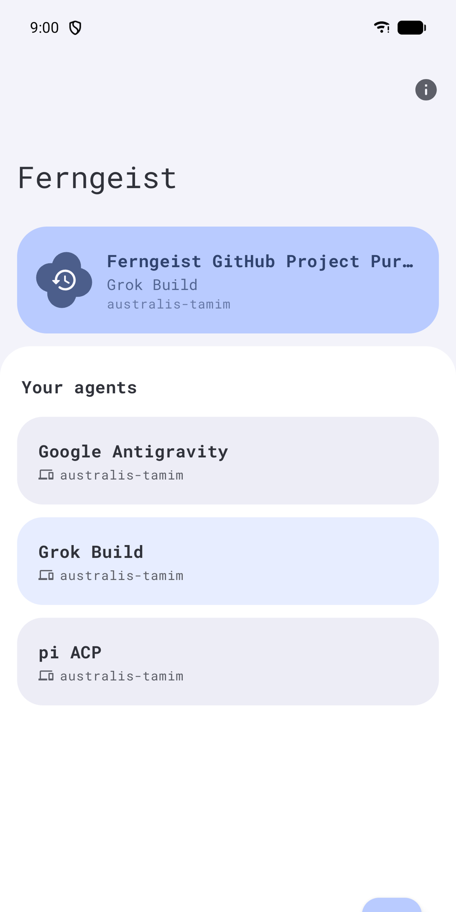
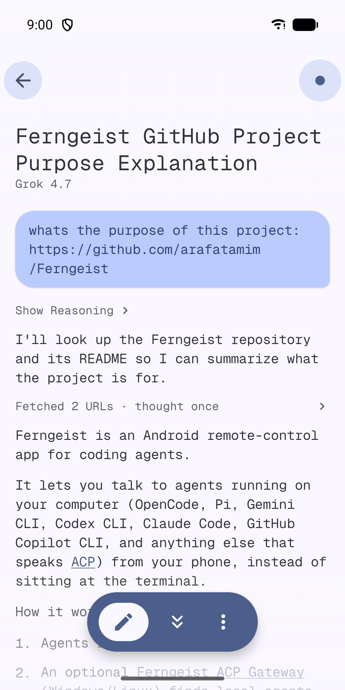
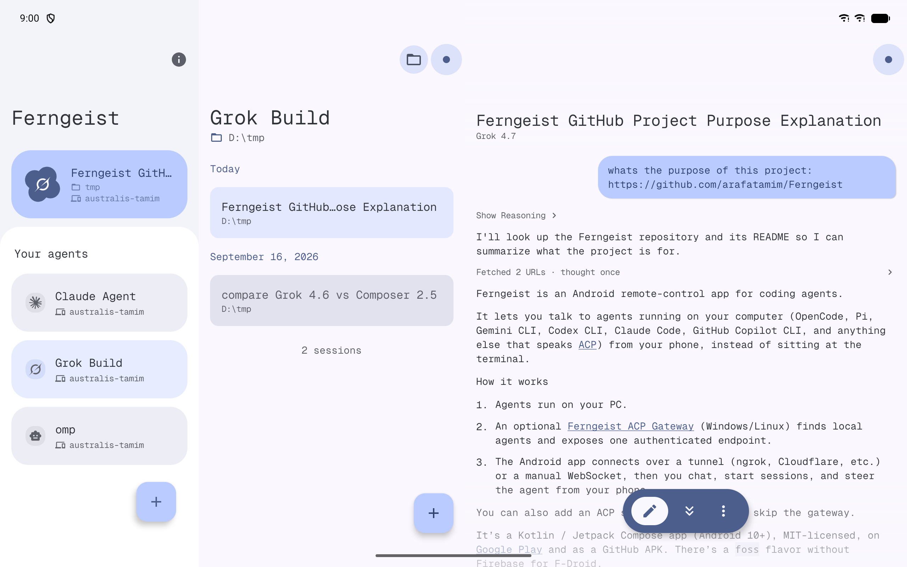
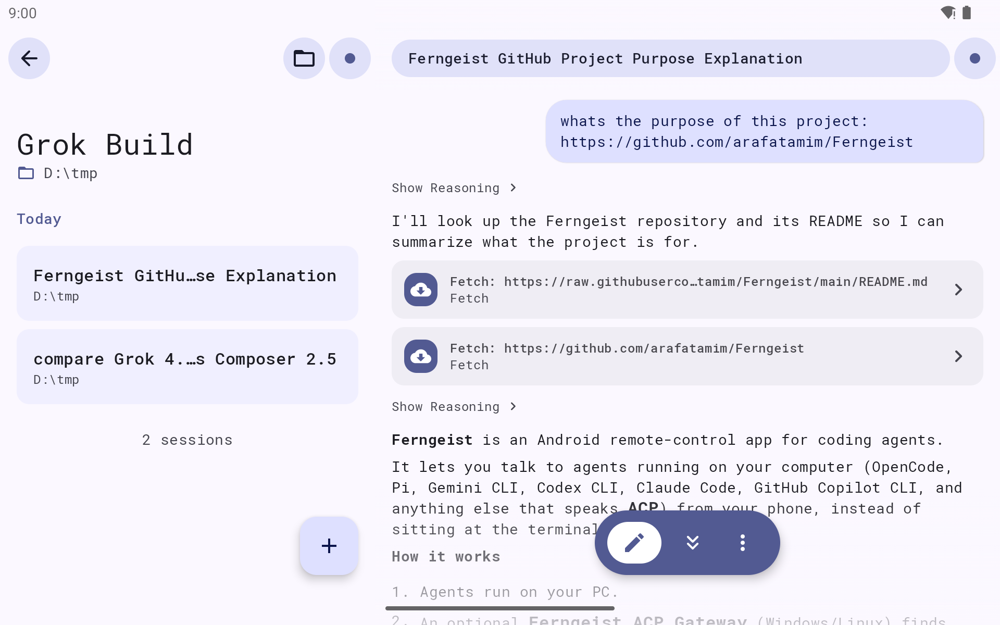
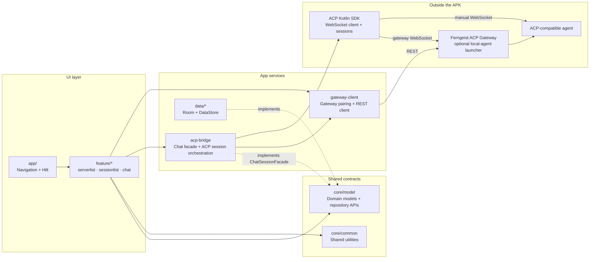

# Ferngeist

[](https://opensource.org/licenses/MIT)
[](https://github.com/arafatamim/ferngeist/releases/latest)

Ferngeist is an Android client for [ACP](https://agentclientprotocol.com/)-compatible coding agents, paired with an optional [Ferngeist ACP Gateway](https://github.com/arafatamim/ferngeist-acp-gateway) that auto-detects local agents and exposes a single authenticated endpoint to the app.

## Download

Ferngeist is available on Google Play.

<a href="https://play.google.com/store/apps/details?id=com.tamimarafat.ferngeist"></a>

Alternatively, download the APK from [GitHub Releases](https://github.com/arafatamim/ferngeist/releases/latest) (manual updates only — Play Store is recommended for auto-updates).

## Screenshots
#### Phone — agents & chat



#### 10" tablet — three-pane workspace


#### 7" tablet — two-pane


## Usage
There are two ways to connect Ferngeist to an ACP agent. The gateway is the easiest if your agents run on your PC.

### Option 1: Ferngeist Gateway (recommended for agents on your PC)

The gateway is a small background service for Windows, macOS and Linux. It finds the ACP agents installed on your computer and gives the app one secure address to connect to.

**1. Install the gateway.** Run the installer for your system:

```powershell
# Windows (PowerShell)
irm https://arafatamim.github.io/ferngeist-acp-gateway/install.ps1 | iex
```

```bash
# macOS / Linux
curl -fsSL https://arafatamim.github.io/ferngeist-acp-gateway/install.sh | sh
```

Prefer a manual install? Grab a package from the [releases page](https://github.com/arafatamim/ferngeist-acp-gateway/releases/latest).

**2. Make it reachable from your phone.** The gateway only listens on your PC (`127.0.0.1:5788`), so your phone needs a public address. The simplest option is built in (Windows: run as Administrator):

```bash
ferngeist-gateway daemon install --remote
```

This sets up a Tailscale Funnel and gives you a stable HTTPS URL. Prefer your own tunnel? Pass its URL with `--public-url`:

<details>
<summary><b>ngrok</b></summary>

```bash
ngrok http 5788
# Copy the HTTPS URL it prints, e.g. https://xxxx.ngrok.io
ferngeist-gateway daemon install --public-url https://xxxx.ngrok.io
```
</details>

<details>
<summary><b>Cloudflare Tunnel</b></summary>

```bash
cloudflared tunnel --url http://localhost:5788
# Copy the URL it prints, e.g. https://xxxx.trycloudflare.com
ferngeist-gateway daemon install --public-url https://xxxx.trycloudflare.com
```
</details>

A custom domain works the same way: `--public-url https://your.domain.example`.

**3. Pair your phone.** Generate a pairing code:

```bash
ferngeist-gateway pair
```

Then in Ferngeist tap **Add server**, enter your tunnel URL, and enter the pairing code. Your agents will show up in the app.

More options are in the [Ferngeist Gateway docs](https://github.com/arafatamim/ferngeist-acp-gateway).

### Option 2: Add an ACP server manually

Use this if you already run an ACP agent over WebSocket. Most agents only speak `stdio`, so wrap them with a WebSocket bridge first. Check the agent's docs for the flags that start it in ACP mode.

Example:
```powershell
npx -y stdio-to-ws "npx @qwen-code/qwen-code@latest --acp" --port 8769
```

Then add `ws://<your-pc-ip>:8769` in Ferngeist as the server host.

## Supported Agents

Any agent implementing [ACP](https://agentclientprotocol.com/), including Codex CLI, Claude Code, Gemini CLI, GitHub Copilot CLI, and OpenCode. See the [full list](https://agentclientprotocol.com/get-started/agents).

## Tech Stack

- Kotlin 2.4 / Jetpack Compose + Material 3
- Hilt / Room / Kotlin Coroutines and Flow / KSP
- ACP Kotlin SDK

Requires Android 11+ (`minSdk = 30`).

## Build

The app has two product flavours under the `distribution` dimension:

- `google` — the full build with ML Kit QR scanning. This is what ships to Google
  Play and GitHub releases. Push notifications arrive through a
  [UnifiedPush](https://unifiedpush.org) distributor if you have one (e.g. ntfy),
  otherwise through Google Play Services — no Firebase project involved.
- `foss` — a Fully Open-Source Software build for F-Droid. It omits ML Kit, so QR
  scanning is replaced by the manual pairing-code field, and it has no Play Services
  fallback: **push notifications need a UnifiedPush distributor app** such as ntfy.
  Without one the agent keeps running on your gateway; you just don't get tapped when
  it finishes.

```powershell
cmd /c gradlew.bat :app:assembleGoogleDebug
```

## Architecture



**Key data flow:**
1. `app/` owns navigation and Hilt bindings, then routes users into the feature modules.
2. Feature modules render Compose UI and depend on `core/model` contracts instead of persistence details.
3. `data/*` provides the local Room/DataStore implementations for saved servers, gateway bindings, and preferences.
4. `acp-bridge` implements `ChatSessionFacade`, manages ACP connections/sessions, and converts SDK callbacks into app events.
5. `gateway-client` handles pairing and gateway REST calls; the bridge uses it when a chat starts from a gateway-backed agent.
6. Manual servers connect directly to an ACP agent through the SDK, while gateway-backed agents go through the optional Ferngeist ACP Gateway first.

## Project Structure

```
app/                  Android entry point, navigation, theme, DI
acp-bridge/           ACP transport, connection manager, session bridge
core/common/          Shared UI helpers and utilities
core/model/           Domain models and repository interfaces
data/database/        Room database, DAOs, entities
feature/serverlist/   Saved server management UI
feature/sessionlist/  Session listing and creation
feature/chat/         Streaming chat UI, reducers, markdown state
gateway-client/       Ferngeist ACP Gateway HTTP client
gradle/               Version catalog
```

## Reporting Issues
Bug reports and feature requests welcome on [GitHub Issues](https://github.com/arafatamim/ferngeist/issues).

## Further Reading
- [Introduction to Agent Client Protocol](https://agentclientprotocol.com/get-started/introduction)
- [Jetpack Compose](https://developer.android.com/compose)

## License

MIT. See [LICENSE](LICENSE).

## Privacy Policy

See [Privacy Policy](docs/privacy_policy.md).
